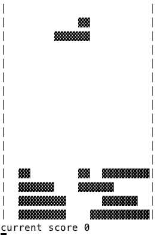

# games

golang实现的运行在终端上的小游戏合集

some games running on the terminal Implemented with golang

# 安装(INSTALLING)
> go install github.com/viile/games

# 执行(Run)
> ./games

# 俄罗斯方块(tetris)

* 按[w]或[方向键上] 旋转方块 (press [w] or [ArrowUp] to spin )
* 按[s]或[方向键下] 加速下落方块 (press [s] or [ArrowDown] to quick down )
* 按[a]或[方向键左] 往左移动方块 (press [a] or [ArrowLeft] to left )
* 按[d]或[方向键右] 往右移动方块 (press [d] or [ArrowRight] to right )
* 按esc 退出游戏 (press [esc] to exit game)

# 贪吃蛇(snake)

* 按[w]或[方向键上] 向上移动 (press [w] or [ArrowUp] to up )
* 按[s]或[方向键下] 向下移动 (press [s] or [ArrowDown] to down )
* 按[a]或[方向键左] 往左移动 (press [a] or [ArrowLeft] to left )
* 按[d]或[方向键右] 往右移动 (press [d] or [ArrowRight] to right )
* 按esc 退出游戏 (press [esc] to exit game)
